

  

  
  
  
  

  
  
  
  

  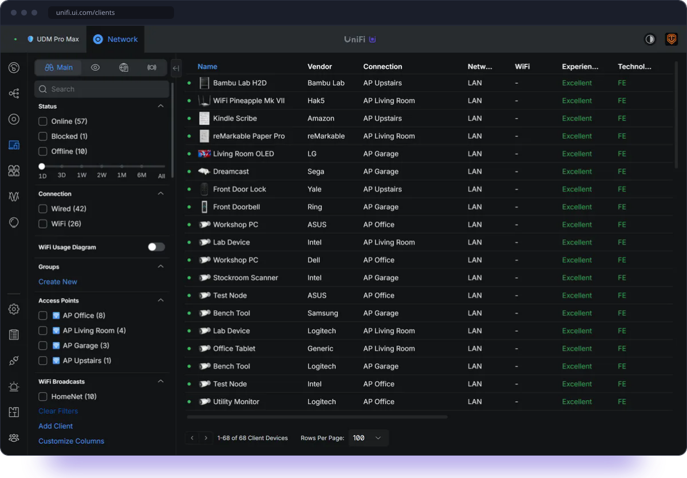

  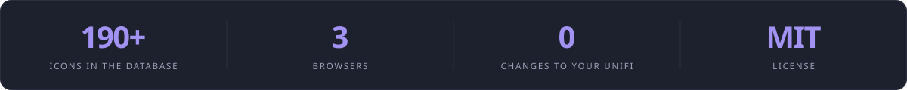

 

  

UniFi's Network admin shows a neat icon for every device it recognizes. For everything it does not, you get a generic placeholder. Ubicon fills that gap: it lets you assign the right icon to any client, from a community database or your own image, and that icon then shows up everywhere UniFi displays the device: the client list, the detail panel, dashboard widgets, insights and flows, and side panes.

  

UniFi's fingerprinting is excellent for mainstream gear, but it does not know the less common devices: Bambu Lab and Prusa printers, e-readers, handheld and retro consoles, Hak5 tools, industrial controllers, and hundreds of other things people actually run at home and at work. Ubicon fixes the look without ever changing your configuration, and it does it in a way the whole community can extend.

 

  

  
  
  

  
  
  

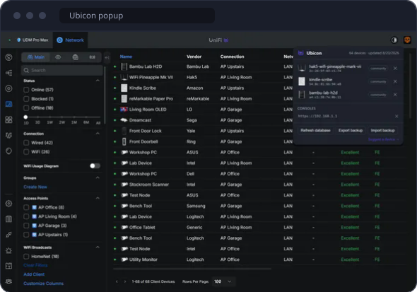

**The popup is your overview.** Click the Ubicon button in the toolbar to see every device you have assigned, remove an assignment, export or import a backup, and add a local console.

**A badge says it is working.** A small Ubicon mark appears next to UniFi's own logo in the header whenever the extension is active on the page.

**Matching that survives renames.** Clients are keyed by MAC address first, with a fallback to the display name on pages that do not expose one, so the icon follows the device wherever UniFi shows it.

 

 

  

  
  
  

  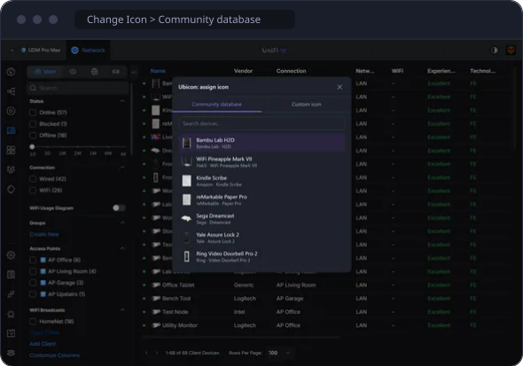
  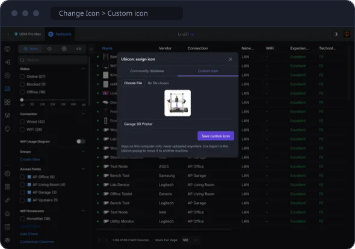

Ubicon lives inside UniFi's existing Change Icon dialog: a small mark next to the title opens the picker, so assigning an icon feels like part of the product. Pick a device from the search, or drop in any image and it is resized to a clean 128px icon on the spot.

 

  

Optional, and off unless you set it up. Your icon assignments and custom icons are saved to a private repository in your own GitHub account, and every browser you connect stays in step through it. There is no item limit, custom icons sync too, and it works across Chrome, Edge and Firefox, signed in to the browser or not. A free GitHub account is enough. The author of Ubicon never sees your data.

  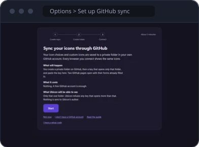
  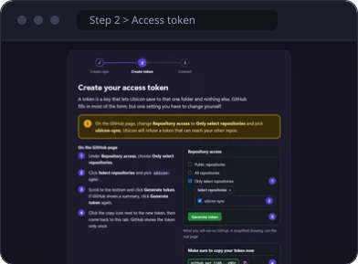
  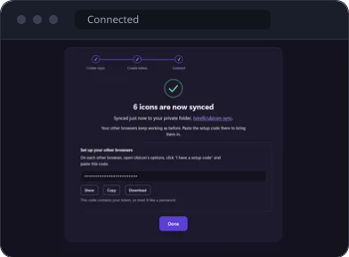

The full reference, with every question we could think of, is the [GitHub sync guide](https://www.tonyvirelli.com/ubicon/github-sync.html). The short version:

<strong>First browser</strong> (about 3 minutes)

Open the Ubicon options page and click **Set up GitHub sync**. The wizard
walks you through three steps, with pictures and buttons that open the right
GitHub page already filled in:

1. **Create your private repo.** Click Open GitHub, then click **Create
   repository** on the page that opens. Everything is filled in: the name
   `ubicon-sync`, and Private.
2. **Create your access token.** Click Open GitHub. On the GitHub page, change
   **Repository access** to **Only select repositories** and pick
   `ubicon-sync`. This is the one thing GitHub cannot fill in for you. Then
   click **Generate token** and copy the token. GitHub shows it only once.
3. **Paste your token** into Ubicon and click **Connect**. Allow the browser
   prompt for `api.github.com`. Ubicon checks the token, uploads your icons,
   and shows a setup code for your other browsers.

Ubicon refuses a token that can reach any repository other than
`ubicon-sync`. If that happens, open the token on GitHub, click Edit, set
Repository access to Only select repositories, pick `ubicon-sync`, save, and
click Connect again. The same token keeps working.

<strong>Every other browser</strong>

Install Ubicon, open its options page, click **I have a setup code**, paste
the code from the first browser (Options, Show setup code) and click Connect.
The setup code contains your token, so treat it like a password. Anything
already assigned in that browser is merged in; for a device assigned in both
places the newest change wins.

Changes reach your other browsers within about five minutes, or right away
with **Sync now**. Each browser is connected on its own: a browser you have
not connected keeps working exactly as before.

<strong>Sharing with other people</strong>

Create one token per person on GitHub (same settings as above) and give them a
setup code made from it. To remove someone, delete their token at
<https://github.com/settings/personal-access-tokens>; nobody else is affected.
A token created with Contents set to **Read-only** gives a view-only browser:
it shows your icons and receives your changes, and cannot change anything.

<strong>Turning it off</strong>

Options, **Disconnect**. That browser forgets the token, stops contacting
GitHub and keeps its icons. Your repository is never deleted by Ubicon; delete
it, and the token, on GitHub if you no longer want them.

<strong>What is in the repository</strong>

`ubicon.json` lists each assigned device by MAC address with its icon, and
`icons/` holds your custom icons as PNG files. It is a plain, readable file, so
keep the repository private. Every sync is one commit, so the history shows
what changed and when. Please do not edit `ubicon.json` by hand; the extension
merges by timestamp and may undo your edit.

 

  

  
  
  
  

- **Chrome and Brave:** install from the Chrome Web Store. Brave uses the same package.
- **Edge:** install from Microsoft Edge Add-ons.
- **Firefox:** install from Firefox Add-ons. Firefox 140 or newer (142 on Android).
- **Manual:** a zip for each browser is attached to every [GitHub release](https://github.com/tvirelli/Ubicon/releases).

Tested on UniFi Network 10.6.106. Ubicon reads the page rather than any UniFi API, so a Network update that changes the page can affect it; when that happens the extension says so and offers a one-click report.

Ubicon works on `unifi.ui.com` out of the box. For a console on your own network, open it in the browser, click the Ubicon toolbar icon, and accept the offer to turn Ubicon on there. One click grants that one address. You can also add an address by hand under Local UniFi controllers in Settings.

 

  

  
  
  

Ubicon is an overlay. It reads the page to find devices and draws icons over them. It never calls the UniFi API, never changes a UniFi setting, and has no server of its own. Assignments live in your browser's storage and, if you use your browser's own sync, travel with your browser account. With GitHub sync on, they also go to a private repository you own, and nowhere else. The full [privacy policy](PRIVACY.md) spells out exactly what is stored where.

 

  

The icon database is its own repository, [tvirelli/Ubicon-DB](https://github.com/tvirelli/Ubicon-DB), and every icon in it came from someone whose gadget UniFi did not recognize. Adding a device is one pull request: an icon file and a few lines of metadata. Contributors are credited by name in the database, and the new icon reaches every Ubicon user on the next refresh without an extension update.

Found a page where the icon does not show, or a device that matches badly? [Open an issue](https://github.com/tvirelli/Ubicon/issues) with the console type and a screenshot. Code contributions are welcome too: the extension is TypeScript on WXT, with a test suite that runs on every change.

 

  

  <a href="https://www.tonyvirelli.com/ubicon/">Website</a> &nbsp;&middot;&nbsp;
  <a href="https://www.tonyvirelli.com/ubicon/github-sync.html">GitHub sync guide</a> &nbsp;&middot;&nbsp;
  <a href="PRIVACY.md">Privacy policy</a> &nbsp;&middot;&nbsp;
  <a href="https://github.com/tvirelli/Ubicon-DB">Device database</a> &nbsp;&middot;&nbsp;
  <a href="https://github.com/tvirelli/Ubicon/releases">Releases</a> &nbsp;&middot;&nbsp;
  <a href="https://github.com/tvirelli/Ubicon/issues">Issues</a>

MIT, see <a href="LICENSE">LICENSE</a>. The device database is separately MIT licensed at <a href="https://github.com/tvirelli/Ubicon-DB">tvirelli/Ubicon-DB</a>.

